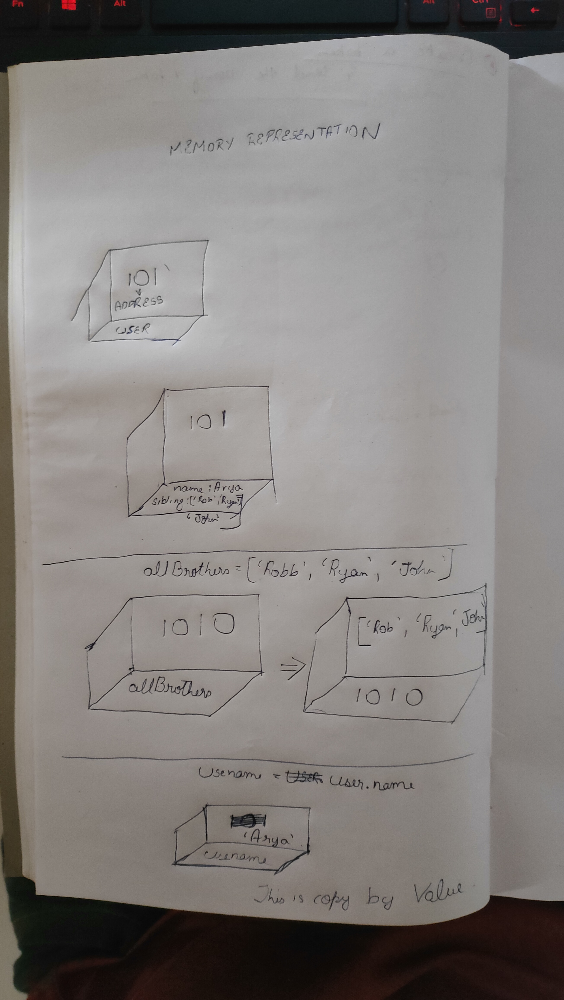

```js
let user = {
  name: 'Arya',
  sibling: ['Robb', 'Ryan', 'John'],
};
let allBrothers = ['Robb', 'Ryan', 'John'];
let brothersCopy = user.sibling;
let usename = user.name;
let newUser = user;
```

1. Memory representation

- Create the memory representation of the above snippet on notebook.
- Take a photo/screenshot and add it to the folder `code`

<!-- To add this image here use  -->
;
;

2. Answer the following with reason:

- `user == newUser;` // true because theyre both objects and the values within the objects are the same and newuser = user
- `user === newUser;` // true because all the contents inside the objects are also same
- `user.name === newUser.name;` // true because since the objects are the same the keys within the objects also will match.
- `user.name == newUser.name;`// true same as above reason
- `user.sibling == newUser.sibling;` // true same reason as above
- `user.sibling === newUser.sibling;` // true same reason as above
- `user.sibling == allBrothers;` // false because although the value might be the same the addresses are different so unless we assign that they are equal, they arnt equal
- `user.sibling === allBrothers;` // false same as above reason
- `brothersCopy === allBrothers;` // false because although the value might be same the data is stored at different addresses so unless assigned itll not match
- `brothersCopy == allBrothers;` // false same as above
- `brothersCopy == user.sibling;` // true 
- `brothersCopy === user.sibling;` // true because they are assigned to each other so the data is stored as copy by value
- `brothersCopy[0] === user.sibling[0];` // here were checking for indivisual value using keys, since the values match it will return true
- `brothersCopy[1] === user.sibling[1];` true same reason as above
- `user.sibling[1] === newUser.sibling[1];` true same reason as above
