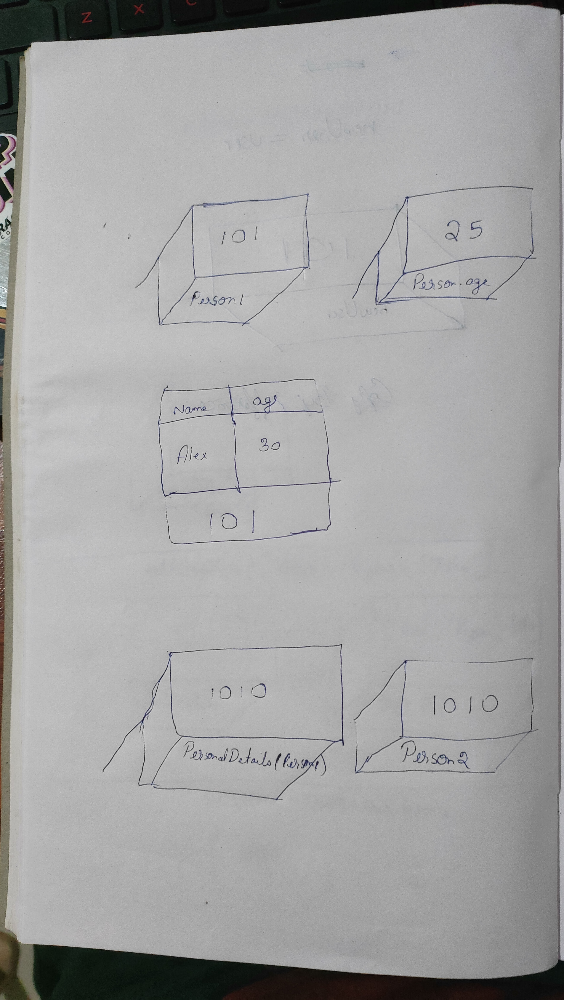

1. What will be the output and explain the reason.

```js
let obj = { name: 'Arya' };
obj = { surname: 'Stark' };
let newObj = { name: 'Arya' };
let user = obj;
let arr = ['Hi'];
let arr2 = arr;
```

Answer the following with reason after going through the above code:

- `[10] === [10]` // both are different objects without a specified name and hense it will be stored in a different address hense not equal
- What is the value of obj? // obj = {name: 'Arya', surname: 'Stark'}
- `obj == newObj` // false newObj will be stored in a different address compared to obj
- `obj === newObj` // false
- `user === newObj` // false different address
- `user == newObj`// false
- `user == obj` // true since theyre assigned to each other the address will be the same
- `arr == arr2` // true since it shares the same primitive value
- `arr === arr2` // true

2. What's will be the value of `person1` and `person2` ? Explain with reason. Draw the memory representation diagram.

<!-- To add this image here use  -->

```js
function personDetails(person) {
  person.age = 25;
  person = { name: 'John', age: 50 };
  return person;
}
var person1 = { name: 'Alex', age: 30 };
var person2 = personDetails(person1);
console.log(person1); // { name: 'Alex', age: 25 }
console.log(person2);// { name: 'John', age: 50 }
```
when personDetails(person1) is called person1.age changes to 25 since its a primitive value.
person2 becomes personDetails(person1) since they share the same address.
person1 keeps its name but age changes due to primitive value

3. What will be the output of the below code:

```js
var brothers = ['Bran', 'John'];
var user = {
  name: 'Sansa',
};
user.brothers = brothers;
brothers.push('Robb');
console.log(user.brothers === brothers); //true
console.log(user.brothers.length === brothers.length); //true
```
